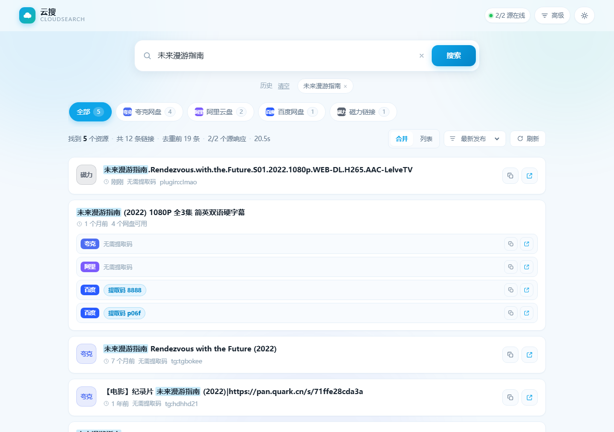

# 云搜 CloudSearch

聚合网盘资源搜索应用。一个搜索框，同时检索夸克、阿里云盘、百度网盘、迅雷、UC、123、天翼、115、PikPak、磁力等多个来源，结果自动归并去重。

界面简洁清新，零第三方依赖（Node 内置模块 + 原生前端）。



## 快速开始

```bash
node server.js
```

然后打开 <http://127.0.0.1:8787>。

端口被占用时会自动顺延到 8788、8789……

## 功能

**搜索**

- 多上游并发聚合，结果按网盘类型归并、按分享链接跨源去重
- 支持按「TG 频道 / 插件站 / 全部」限定搜索源
- 可指定单个或多个插件、频道进行定向搜索
- 5 分钟结果缓存，重复搜索毫秒返回；可点「刷新」强制绕过缓存
- 上游失败自动重试，单源故障不影响整体结果

**结果处理**

- **同一资源的多个网盘链接自动合并成一张卡**，每个网盘一行，点对应入口直接打开；只有单个网盘的资源保持紧凑卡片
- 可切换「合并 / 列表」两种展示方式
- 按网盘类型分页签，带数量角标（口径跟随视图：合并时算资源数，列表时算链接数）
- 排序：最新发布 / 默认相关度 / 名称
- 关键词高亮、提取码自动识别（含从链接 `?pwd=` 中提取）
- 一键复制分享链接、复制提取码、打开链接
- 分页加载，每页 24 条

**体验**

- 搜索历史（本地保存，可单条删除或清空）
- 快捷键：`/` 聚焦搜索框，`Esc` 关闭面板
- 浅色 / 深色主题，跟随系统并可手动切换
- 响应式布局，移动端可用
- URL 带 `?q=关键词`，可直接分享搜索结果

## 目录结构

```
network search/
├── server.js        # 零依赖 Node 服务：静态托管 + 聚合代理 + 缓存
├── config.json      # 端口、超时、上游源配置
├── package.json
├── public/
│   ├── index.html
│   ├── styles.css
│   └── app.js
└── README.md
```

## 配置

编辑 `config.json`：

```json
{
  "port": 8787,
  "host": "127.0.0.1",
  "cacheTTL": 300,
  "timeout": 45000,
  "retries": 1,
  "upstreams": [
    { "name": "PanSou 主站", "base": "https://pansou.app", "enabled": true },
    { "name": "PanSou 镜像", "base": "https://so.252035.xyz", "enabled": true }
  ]
}
```

| 字段 | 说明 |
| --- | --- |
| `port` / `host` | 本地监听地址 |
| `cacheTTL` | 同一关键词的结果缓存秒数 |
| `timeout` | 单个上游请求超时（毫秒） |
| `retries` | 上游失败后的重试次数 |
| `upstreams[].base` | 上游根地址，需实现 PanSou 兼容的 `/api/search` 与 `/api/health` |

增加上游只需往 `upstreams` 里追加一项；自建 PanSou 服务也可以填进来。

## 接口

| 方法 | 路径 | 说明 |
| --- | --- | --- |
| POST | `/api/search` | 聚合搜索。body：`{kw, src, plugins, channels, refresh}` |
| GET | `/api/health` | 上游健康状态、可用插件与频道列表 |
| GET | `/api/config` | 当前生效配置 |

返回统一结构：`{ code, message, data: { total, deduped, raw_count, merged_by_type, sources } }`。

## 说明

- 应用本身不存储任何资源，所有结果均来自公开索引上游。
- 浏览器无法直连上游（Cloudflare CORS 限制），因此由本地 Node 服务代为请求，这也是必须通过 `node server.js` 启动的原因。
- 上游均为第三方公开服务，可用性会波动；某个源挂掉时其余源仍会正常返回。
